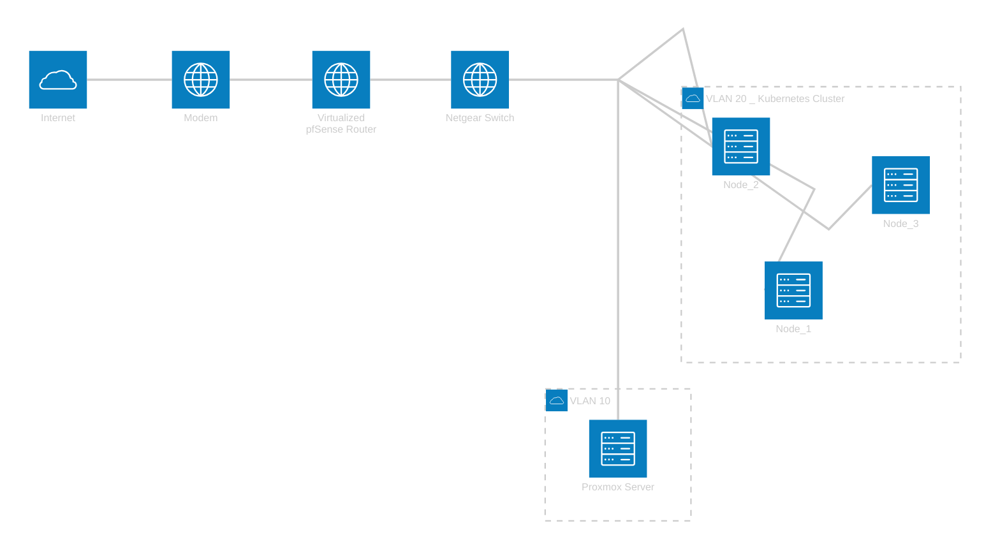

# 🏠 Homelab

This repo contains all of the configuration and documentation of my homelab.
The purpose of my homelab is to learn about IaC, GitOps, Linux, Docker, Kubernetes, Proxmox, etc... and to have fun. The purpose of this repository is simply to share how I manage my home lab.

The homelab setup is constantly evolving and being improved. 
Your comments and suggestions are welcome!

## 📋 Quick Overview

| **Component** | **Technology** | **Purpose** |
|---------------|----------------|-------------|

## ️ Architecture

### 🗺️ Network Architecture



### 🗺️ System Architecture

```
```

### 📁 Repository Structure
```

```
